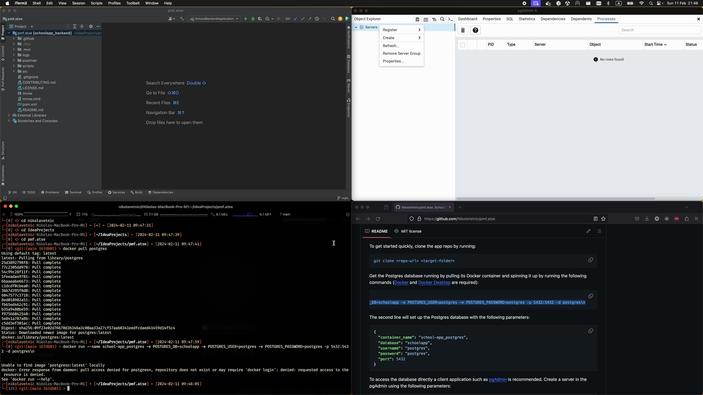

# School Data App

School Data App is an open source backend web app imagined as a small-scale data tracking app intended for use in a small elementary school. Data model includes several user roles (admin, students, parents, teachers) and entities that describe the curriculum and the students (lectures, subjects, grades, and others).

Some of the basic functionalities include (but are not limited to):

-   tracking students' grades,
-   viewing students' grades (by either their teachers, parents or students themselves),
-   logging lectures and absences,
-   notifying parents of students' grades, etc.

For a more extensive list of features please consult the following section.

## Quick Start

[](https://youtu.be/sElTN4UqzYE)

### Prerequisites

To run and contribute to the School Data App the following is required:

1. Java-capable web IDE - the project has been confirmed to run on Eclipse IDE and IntelliJ IDEA.
2. PostgreSQL database - it is recommended to run it as a Docker container, and for that reason Docker and Docker Desktop are required as well.
3. Database client app - pgAdmin in recommended.

### Installing

To get started quickly, clone the app repo by running:

```console
git clone <repo-url> <target-folder>
```

Get the Postgres database running by pulling its Docker container and spinning it up by running the following commands ([Docker](https://docs.docker.com/engine/install/) and [Docker Desktop](https://www.docker.com/products/docker-desktop/) are required):

```console
docker pull postgres
docker run --name school-app_postgres -e POSTGRES_DB=schoolapp -e POSTGRES_USER=postgres -e POSTGRES_PASSWORD=postgres -p 5432:5432 -d postgres\n
```

The second line will set up the Postgres database with the following parameters:

```json
{
    "container_name": "school-app_postgres",
    "database": "schoolapp",
    "username": "postgres",
    "password": "postgres",
    "port": 5432
}
```

To access the database directly a client application such as [pgAdmin](https://www.pgadmin.org/download/) is recommended. Create a server in the pgAdmin using the following parameters:

```json
{
    "Host name / address": "127.0.0.1",
    "Port": "5432",
    "Maintenance database": "postgres",
    "Username": "postgres",
    "Password": "postgres"
}
```

Once the server is set up create a database for the School App (default name is `schoolapp`). Running the Spring Boot project once should create the necessary database tables.

Included in the project is a [Postman collection of HTTP requests](./postman/school-app.postman_collection.json) that demonstrates some of the functionality of the App.

## Running the Tests

School Data App is developed using a Test-Driven Development approach. All the tests are available in the `test` package and may be easily run from within the IDE itself.

## Built With

-   [Spring Boot](https://spring.io/projects/spring-boot/)
-   [Maven](https://maven.apache.org/)
-   [JUnit](https://junit.org/junit5/)

## Contributing

Please read [CONTRIBUTING.md](./CONTRIBUTING.md) for details on our code of conduct, and the process for submitting pull requests to us.

## Versioning

We use [SemVer](https://semver.org/) for versioning. For the versions available, see the tags on this repository.

## Authors

-   Nikola Vetnić - Initial work - [GitHub](https://github.com/NikolaVetnic)

See also the list of contributors who participated in this project.

## License

This project is licensed under the MIT License - see the [LICENSE.md](./LICENSE.md) file for details.
